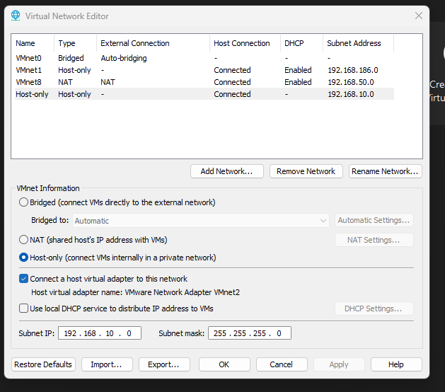
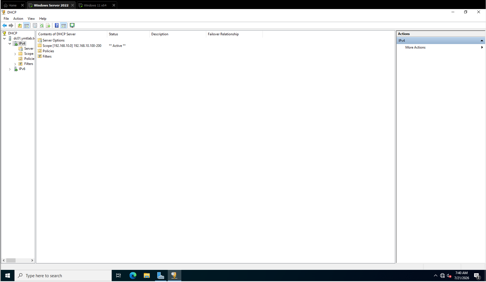
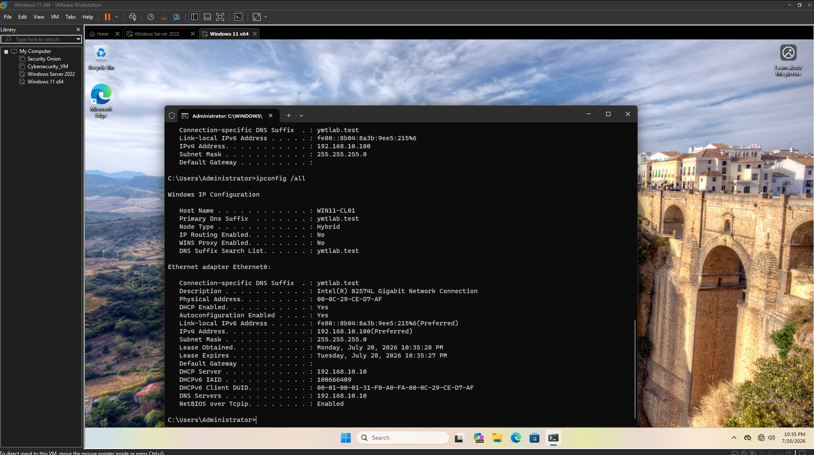

# YMTL-LAB-001: Windows Server 2022 Home Lab

Build an isolated Windows Server training environment with Active Directory, DNS, DHCP, and a domain-joined Windows 11 client.

## Objectives

- Create a private VMware Host-only network.
- Configure `DC01` as the first domain controller for `ymtlab.test`.
- Provide DNS and DHCP from DC01.
- Join `WIN11-CL01` and verify its lease and DNS configuration.

## Lab Topology

```text
YMTL-LAB-NET (192.168.10.0/24, VMware VMnet2)
|
|-- DC01        192.168.10.10  AD DS, DNS, DHCP
`-- WIN11-CL01  DHCP client    joined to ymtlab.test
```

This is a Host-only training network. Leave the default gateway blank unless you add a real router or firewall.

## Requirements

- VMware Workstation
- Windows Server 2022 ISO
- Windows 11 ISO
- At least 8 GB RAM and 124 GB available disk space

## Implementation

1. Create or select Host-only `VMnet2` with subnet `192.168.10.0/24` and disable VMware DHCP.
2. Create `DC01` with 2 vCPU, 4 GB RAM, 60 GB disk, and a VMnet2 adapter.
3. Configure DC01 with static IP `192.168.10.10/24`. Set the preferred DNS server to `192.168.10.10`; leave the default gateway blank.
4. Install AD DS and DNS, then promote DC01 to a new forest named `ymtlab.test`.
5. Install and authorize DHCP. Create scope `192.168.10.0/24` with range `192.168.10.100-200`.
6. Set DHCP option 006 (DNS Servers) to `192.168.10.10`; leave option 003 (Router) empty; activate the scope.
7. Create `WIN11-CL01` with a VMnet2 adapter. Keep IPv4 on DHCP, rename it, and join `ymtlab.test`.

## Verification

On `WIN11-CL01`, run:

```powershell
ipconfig /all
```

Expected values:

| Check | Expected value |
| --- | --- |
| IPv4 address | `192.168.10.100` through `192.168.10.200` |
| DHCP server | `192.168.10.10` |
| DNS server | `192.168.10.10` |
| DNS suffix | `ymtlab.test` |
| Default gateway | Blank |

## Evidence







## Troubleshooting

- **No client IP address:** confirm VMware DHCP is disabled and the Windows DHCP scope is active.
- **Domain cannot be found:** verify the client DNS server is `192.168.10.10`.
- **Domain join fails:** confirm DC01 and WIN11-CL01 are both connected to VMnet2.
- **Unexpected default gateway:** remove DHCP option 003, renew the client lease, and verify again.

## Product Guide

The illustrated step-by-step guide is available as **YMTL-PRD-001: Windows Server 2022 Home Lab Starter Guide**.

> Learn. Build. Secure.


## Verification Evidence

These screenshots verify the completed lab environment.

### VMware Host-Only Network


### DHCP Scope


### Domain-Joined Client


## Companion Guide

For the complete guided walkthrough, get the [Windows Server 2022 Home Lab Starter Guide](https://techlabsyam.gumroad.com/l/windows-server-2022-home-lab-starter-guide).
